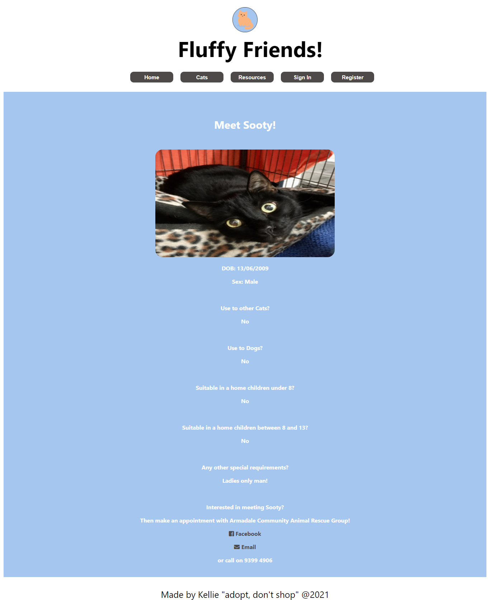

# Fluffy Life Friends App

## Table of Contents

- [Description](#description)
- [Installation](#installation)
- [Usage](#usage)
- [Links](#links)
- [Resources](#resources)
- [Screenshots](#screenshots)

## Description

This awesome App showcases the wonderful cats that are up for adoption!

This app uses:
- React
- GraphQL
- MongodDB
- JWT
- Apollo
- Bcrypt

## Installation

To Install this app onto your own computer:
* Clone the Repository
* Open up your terminal and change into the cloned folder
* Type "npm i" to install the dependancies
* If you would like to start with some data then type 'npm run seed' and watch the cute cats  be added to the MongoDB database
* Then lastly type 'npm run develop' to start the site!

Otherwise just click on the 'deployed website' link in the Links Section to use the app!

## Usage

* People can view a list of Adpotable Cats and their details by clicking on the "Cats" button!
* Shelter Workers can sign up/in to add, update or delete a cat from the database!

## Links

* gitHub: https://github.com/Kel03-byte/fluffy-life-friend-app
* Deployed website: https://fluffy-life-friends.herokuapp.com/

## Resources

* [Press Release](https://docs.google.com/document/d/1_YDwRyGK-HfiYP21BZEY76_JgJwDGi5KjhD2B0wYH8Y/edit)
* [User Story Map](https://miro.com/app/board/o9J_l4WQGZU=/)
* [Presentation Slide](https://docs.google.com/presentation/d/1WeS-ChQq1do9_JSgSSUJVosbPSM4BW0WgJS28PYUOzA/edit#slide=id.p)
* [Presentation Speech](https://docs.google.com/document/d/15VxTWW9Q8S9dqSRC0XJNoaKpFVTqNDlKDZXQFDytz2c/edit)

## Screenshots

Home Page

Cats Page

Cat Details Page

Resource Page

Sign Up Page

Sign In Page

Add A Cat Page

Edit Cat List Page

Edit A Cat Page
