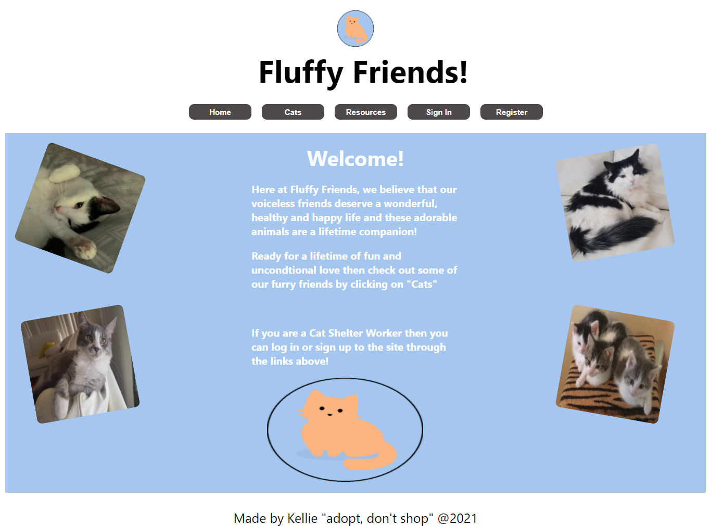

# Fluffy Life Friends App

## Table of Contents

- [Description](#description)
- [Installation](#installation)
- [Usage](#usage)
- [Links](#links)
- [Screenshots](#screenshots)

## Description

This awesome App showcases the wonderful cats that are up for adoption!

This app uses:
- React
- GrapgQL
- MongodDB
- JWT
- Apollo
- Bcrypt

## Installation

To Install this app onto your own computer:
* Clone the Repository
* Open up your terminal and change into the cloned folder
* Type "npm i" to install the dependancies
* If you would like to start with some data then type 'npm run seed' and watch the cute cats  be added to the MongoDB database
* Then lastly type 'npm run develop' to start the site!

Otherwise just click on the 'deployed website' link in the Links Section to use the app!

## Usage

* People can view a list of Adpotable Cats and their details by clicking on the "Cats" button!
* Shelter Workers can sign up/in to add or delete a cat from the database!

## Links

* gitHub: https://github.com/Kel03-byte/fluffy-life-friend-app
* Deployed website: https://fluffy-life-friends.herokuapp.com/

## Screenshots

Home Page

Cats Page

Cat Details Page

Resource Page

Sign Up Page

Sign In Page

Add A Cat Page
